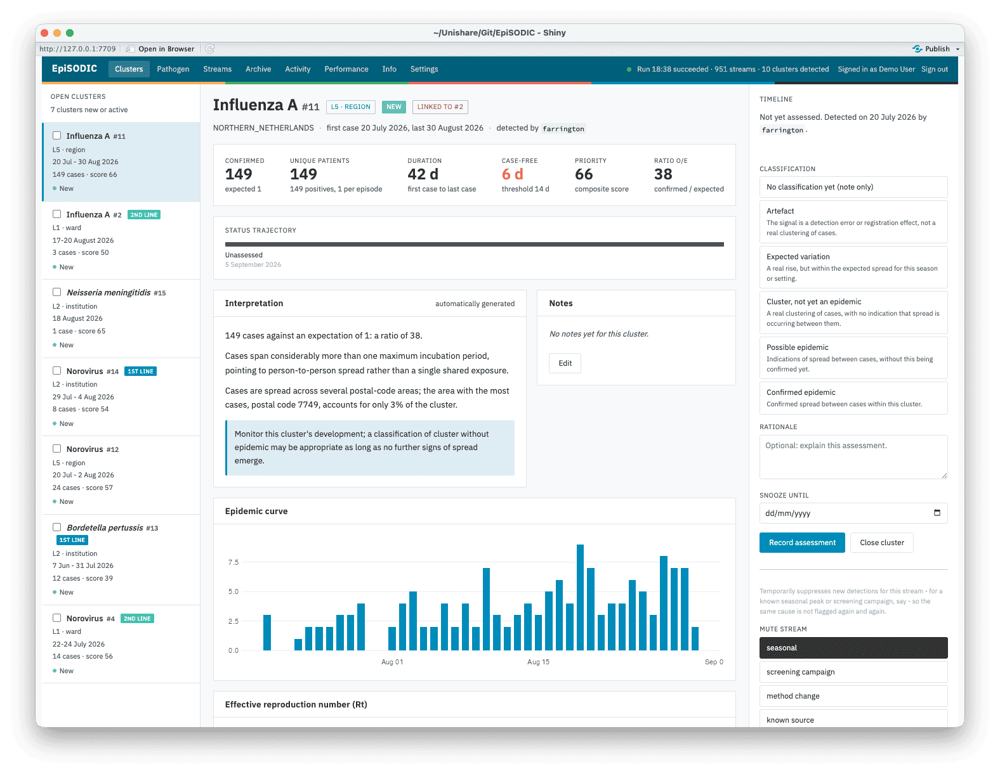
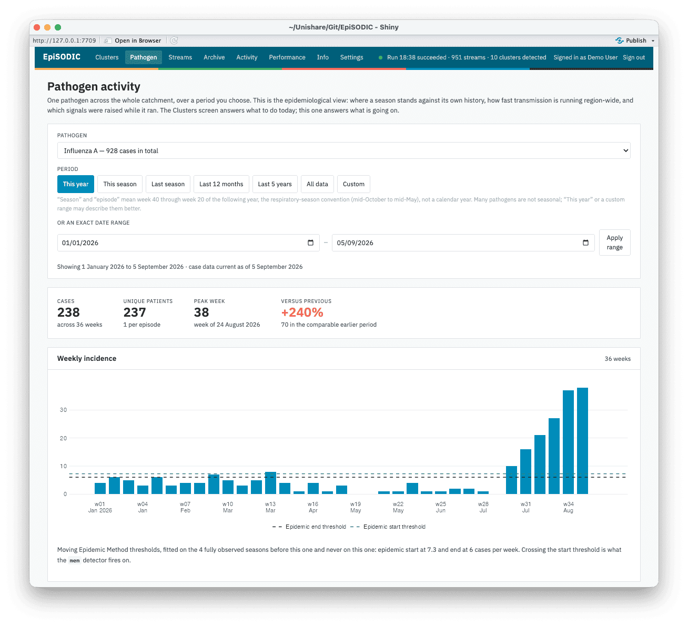
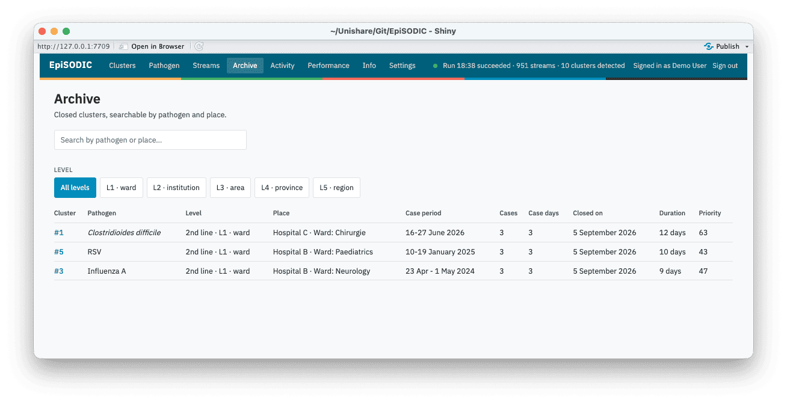

```{r, include = FALSE}
knitr::opts_chunk$set(collapse = TRUE, comment = "#>", eval = FALSE)
```

EpiSODIC is an automated outbreak cluster detection and assessment system
for infectious disease epidemiologists. It runs in R, reads
laboratory-confirmed infections, detects statistical and rule-based
aberrations, reconciles them into persistent clusters, and gives
epidemiologists a dossier to assess each one, with a full audit trail and
outbreak reports for clinical colleagues (e.g. clinical microbiologists)
and infection prevention nurses.

The dashboard and its outbreak reports are available in English,
(Modern Standard) Arabic, Dutch, French, German, Hindi, Mandarin
Chinese, and Spanish.

<!--
Screenshots below live in man/figures/ (ships with the package, so
they also render on the CRAN page), regenerated against episodic_demo().
-->
<p align="center">
  
  <br>
  <em>A cluster dossier - case stats, status trajectory, an automatically generated interpretation of the evidence, the epidemic curve, and the classification panel, alongside the rail of open clusters.</em>
</p>

## No dependency on any one laboratory system

EpiSODIC never queries a laboratory information system, data warehouse, or
any other data source itself - extracting and transforming your data into
its expected shape is deliberately your own step, run before EpiSODIC.
See `vignette("data-format")` for exactly what that shape is. This keeps
the detection engine reusable by any laboratory: every dependency is a
CRAN-hosted package (`surveillance` for Farrington; no private,
organisation-specific package is required or even referenced).

House colours and typography (`episodic_palette()`) come from a shipped,
organisation-neutral default, overridable per instance by pointing
`EPISODIC_STYLE` at a YAML file with an organisation's own
colours and font - the same mechanism used for detection configuration, a
custom report template, and geographic reference data (see
`vignette("deployment")` and `vignette("environment-variables")`).
Geography (the choropleth panel) is not tied to any one organisation or
country either.

Detection thresholds and priority score weights are configurable per
instance (`r doc_system_file("inst/config/episodic_default_config.yaml")`, `EPISODIC_CONFIG`), so an
organisation can tune them against its own signal volume as its evidence
base grows - see `vignette("detection-reconciliation")` for how the
detectors themselves work, and the FAQ for how to change the
configuration.

## Two altitudes

EpiSODIC gives you two different views of the same detected signals,
because "should we act on this cluster" and "is this pathogen unusual
this season" are different questions that need different units of
analysis.

### The Clusters screen: one signal at a time

The **Clusters** screen is operational: a ranked queue of discrete
signals, each one something a person has to make and record a decision
about. That is the right unit for triage and the wrong unit for
surveillance - "is influenza A unusual this season, and where in the
season are we" is not a question about any one cluster, and cannot be
answered by reading several dossiers in turn.

Every cluster opens into a dossier: case statistics, its status
trajectory, an automatically generated plain-language interpretation of
the evidence, the epidemic curve, similar past clusters and their
verdicts as precedent, and the classification panel where an
epidemiologist records their assessment.

### The Pathogen screen: one pathogen over a period

Pick a pathogen and a period - a surveillance season (ISO week 40 to week
20), the last twelve months, the last five years, or an exact date range
- and it describes that pathogen across the whole catchment over that
period:

- weekly incidence, with the Moving Epidemic Method's pre- and
  post-epidemic thresholds and its medium/high/very high intensity bands
  drawn on it, fitted only on the seasons *before* the one being looked
  at;
- the same period laid over earlier seasons (or, for a non-seasonal
  pathogen, earlier calendar years) on a shared week-within-period axis,
  so "earlier", "later", "bigger", "smaller" can be read directly;
- Rt for the pathogen as a whole rather than per cluster - which is the
  population the renewal model assumes it is seeing - conditioned on case
  history from before the selected period;
- testing volume and positivity, age and sex against the pathogen's own
  long-run distribution, geography, and care-line and institution
  breakdowns;
- and the clusters that were raised during the period, with the verdict
  each one received, as the way back to the operational view.

<p align="center">
  
  <br>
  <em>The Pathogen screen - weekly numbers of cases, reproduction number, with geographic and demographic distribution.</em>
</p>

## Beyond the two altitudes

The rest of the dashboard - Performance, Archive, Streams, Activity, and
Info - rounds out these two, each answering a narrower question than
"should we act on this cluster" or "is this pathogen unusual this
season":

### The Performance screen: is detection itself working

Detection timeliness and positive predictive value per detector and
pathogen, computed from stored verdicts. Both fill in as clusters get
assessed, so tuning `EPISODIC_CONFIG` against your own signal volume is
an evidence-based exercise rather than a guess, once your board has
classified enough clusters to have a baseline.

### The Archive screen: last winter's precedent

Every closed cluster, searchable by pathogen and place, sorted by
period. A closed dossier is not filed away - it stays reachable and
reasoned exactly the way an open one is, since last winter's assessment
is often the best prior evidence for judging this winter's cluster.

<p align="center">
  
  <br>
  <em>The Archive screen - previously detected clusters.</em>
</p>

### Streams and Activity: how the machinery is behaving

**Streams** lists every stream the lattice is currently watching
(pathogen x level x institution/area/ward/region) alongside the
detection configuration resolved for it at the latest run - the place
to look when "why didn't this fire" needs a concrete answer rather than
a guess. **Activity** is the audit log: every assessment, closure, mute,
sign-in, and scheduled run, with a system action visually distinct from
a person's. Between the two, nothing the system did (or did not do) is
ever only inferable from its effects.

### The Info screen

The running instance's own version, licence, and configuration, read
live from the package itself - useful when reporting an issue, or
simply confirming which build is deployed.

## Where to go next

- **`vignette("data-format")`** - the case data contract: what columns to
  send, what each means, and how to check your extract before you
  schedule anything.
- **`vignette("deployment")`** - standing up a real instance: accounts,
  the database backend, and where configuration lives.
- **`vignette("environment-variables")`** - the full `EPISODIC_*`
  reference table.
- **`vignette("detection-reconciliation")`** - how a laboratory result
  becomes a dossier: the four detectors, reconciliation, and suppression.
- **`vignette("faq")`** - answers to the questions that come up most
  often when getting started.

Or skip straight to seeing it work - no data, no credentials, no
configuration required:

```r
EpiSODIC::episodic_demo()
```
