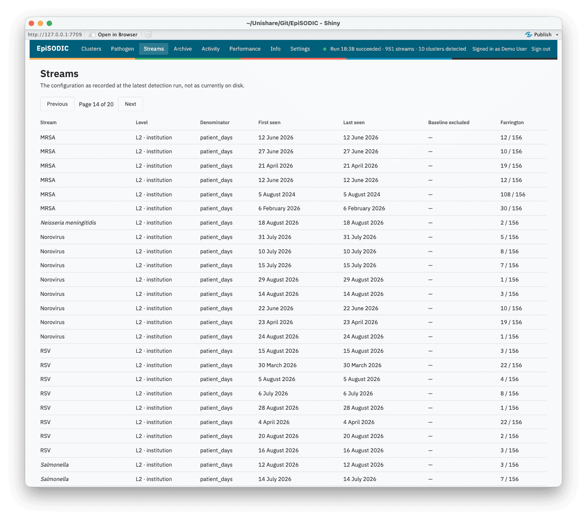
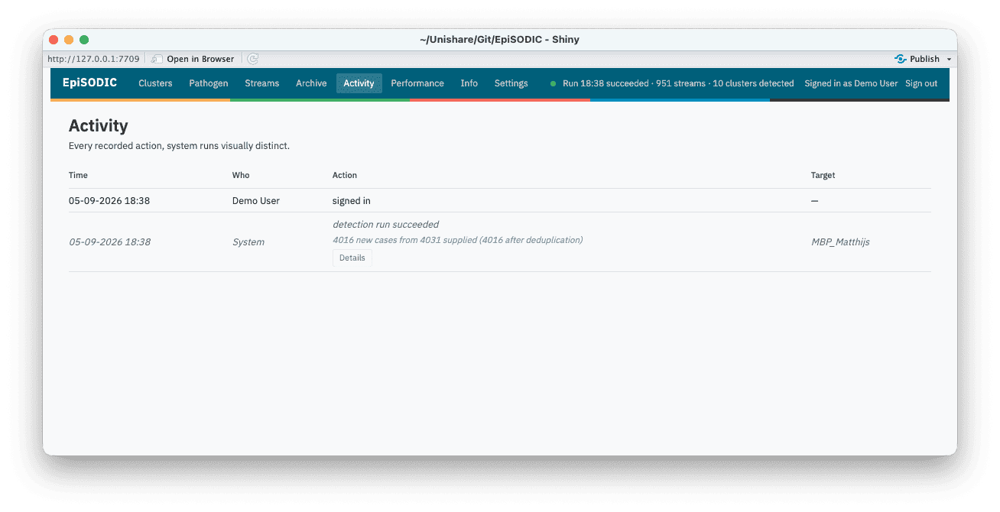
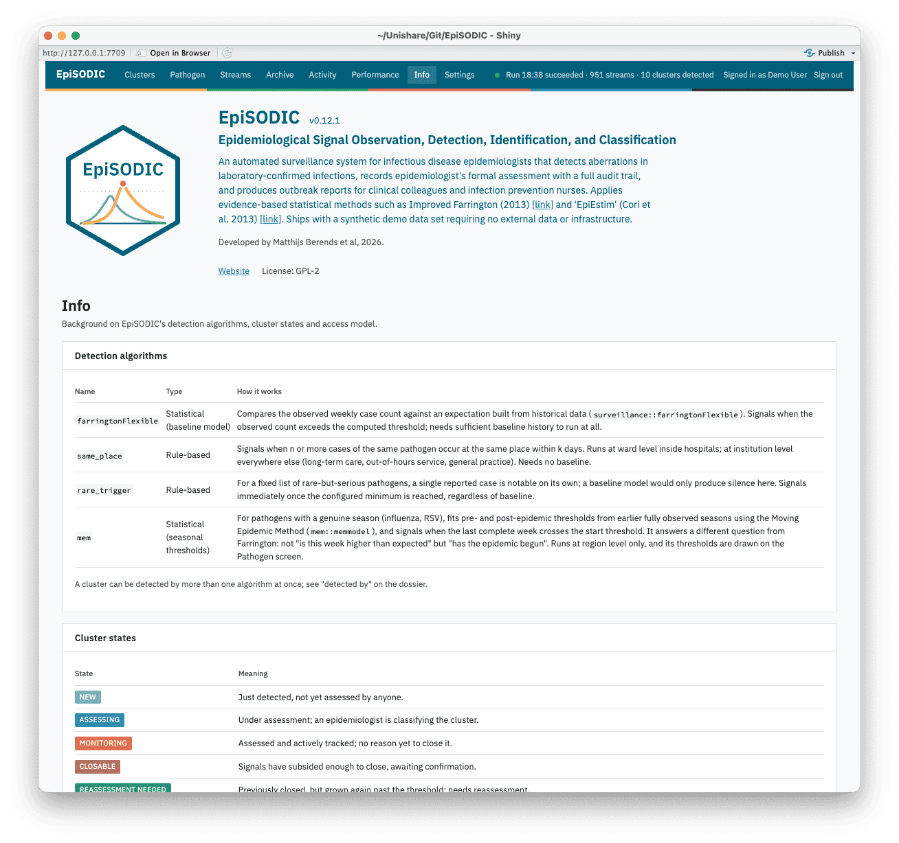
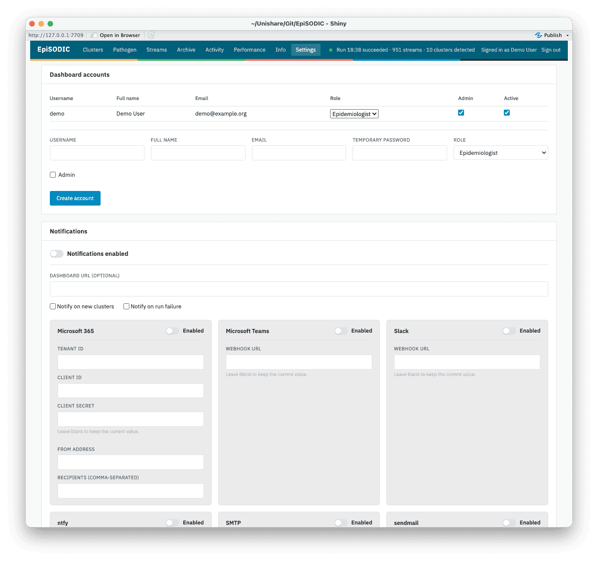

```{r, include = FALSE}
knitr::opts_chunk$set(collapse = TRUE, comment = "#>", eval = FALSE)
```

EpiSODIC is an automated outbreak and epidemic detection and assessment system for infectious disease epidemiologists. It runs in R, reads laboratory-confirmed infections, detects statistical and rule-based aberrations, reconciles them into persistent outbreaks (localised, at ward through area level) and epidemics (regional, at province and catchment level), and gives epidemiologists a dossier to assess each one, with a full audit trail and outbreak reports for clinical colleagues (e.g. clinical microbiologists) and infection prevention nurses.

The dashboard and its outbreak reports are available in English, (Modern Standard) Arabic, Dutch, French, German, Hindi, Mandarin Chinese, and Spanish.

## No dependency on any one laboratory system

EpiSODIC never queries a laboratory information system, data warehouse, or any other data source itself - extracting and transforming your data into its expected shape is deliberately your own step, run before EpiSODIC. See `vignette("data-format")` for exactly what that shape is. This keeps the detection engine reusable by any laboratory: every dependency is a CRAN-hosted package (`surveillance` for Farrington; no private, organisation-specific package is required or even referenced).

House colours and typography (`episodic_palette()`) come from a shipped, organisation-neutral default, overridable per instance by pointing `EPISODIC_STYLE` at a YAML file with an organisation's own colours and font - the same mechanism used for detection configuration, a custom report template, and geographic reference data (see `vignette("deployment")` and `vignette("environment-variables")`). Geography (the choropleth panel) is not tied to any one organisation or country either.

Detection thresholds and priority score weights are configurable per instance (`r EpiSODIC:::doc_system_file("inst/config/episodic_default_config.yaml")`, `EPISODIC_CONFIG`), so an organisation can tune them against its own signal volume as its evidence base grows - see `vignette("detection-reconciliation")` for how the detectors themselves work, and the FAQ for how to change the configuration.

## Three altitudes

EpiSODIC gives you three different views of the same detected signals, because "should we act on this outbreak", "has the epidemic season started" and "is this pathogen unusual this season" are different questions that need different units of analysis.

### The Outbreaks screen: one outbreak at a time

The **Outbreaks** screen is operational: a ranked queue of discrete outbreaks (L1 through L3), each one something a person has to make and record a decision about. That is the right unit for triage and the wrong unit for surveillance, just as a single outbreak dossier cannot tell you whether the influenza season has started.

Every outbreak opens into a dossier: case statistics, its status trajectory, an automatically generated plain-language interpretation of the evidence, the epidemic curve, similar past outbreaks and their verdicts as precedent, and the classification panel where an epidemiologist records their assessment.

<!-- Screenshots below live in man/figures/ (ships with the package, so they also render on the CRAN page), regenerated against episodic_demo(). -->
<p align="center">
  
</p>

### The Epidemics screen: regional and seasonal

The **Epidemics** screen shows epidemics, the regional-scale signals at province (L4) and catchment (L5) level. An epidemic's dossier carries the weekly case curve with MEM threshold overlay, tests and positivity, contributing institutions with concentration, and a list of outbreaks recorded as occurring during it. Each of those outbreaks carries a "During E-123" chip on its own dossier, so the relation reads from either end.

The screen is laid out exactly like the Outbreaks screen, and an epidemic is assessed on the same form: it can be an artefact or expected variation like any other signal. Where the epidemic is seasonal, that form additionally offers the **declaration** - whether the season has started, has not yet started, or has ended. That is an act with policy consequences across multiple hospitals, which the system raises but never performs automatically, and it is offered only where there is a season to declare.

### The Pathogen screen: one pathogen over a period

Pick a pathogen and a period, the last three months, the last twelve months, the last five years, or an exact date range, and it describes that pathogen across the whole catchment over that period:

- weekly incidence, with the Moving Epidemic Method's pre- and
  post-epidemic thresholds and its medium/high/very high intensity bands
  drawn on it, fitted only on the seasons *before* the one being looked
  at;
- the same period laid over earlier seasons (or, for a non-seasonal
  pathogen, earlier calendar years) on a shared week-within-period axis,
  so "earlier", "later", "bigger", "smaller" can be read directly;
- Rt for the pathogen as a whole rather than per outbreak, which is the
  population the renewal model assumes it is seeing, conditioned on case
  history from before the selected period;
- testing volume and positivity, age and sex against the pathogen's own
  long-run distribution, geography, and care-line and institution
  breakdowns;
- and the outbreaks that were raised during the period, with the verdict
  each one received, as the way back to the operational view.

<p align="center">
  
</p>

## Beyond the three altitudes

The rest of the dashboard, Performance, Archive, Streams, Activity, and Info, rounds out these three, each answering a narrower question than "should we act on this outbreak" or "has the epidemic season started":

### The Performance screen: is detection itself working

Detection timeliness and positive predictive value per detector and pathogen, computed from stored verdicts on outbreaks (L1-L3). Both fill in as outbreaks get assessed, so tuning `EPISODIC_CONFIG` against your own signal volume is an evidence-based exercise rather than a guess, once your board has classified enough outbreaks to have a baseline.

<p align="center">
  
</p>

### The Archive screen: last winter's precedent

Every closed outbreak and epidemic, searchable by pathogen and place, sorted by period. A closed dossier is not filed away, it stays reachable and reasoned exactly the way an open one is, since last winter's assessment is often the best prior evidence for judging this winter's outbreak.

<p align="center">
  
</p>

### Streams and Activity: how the machinery is behaving

**Streams** lists every stream the lattice is currently watching (pathogen x level x institution/area/ward/region) alongside the detection configuration resolved for it at the latest run - the place to look when "why didn't this fire" needs a concrete answer rather than a guess.

<p align="center">
  
</p>

**Activity** is the audit log: every assessment, closure, mute, sign-in, and scheduled run, with a system action visually distinct from a person's. Between the two, nothing the system did (or did not do) is ever only inferable from its effects.

<p align="center">
  
</p>

### The Info screen

The running instance's own version, licence, and configuration, read live from the package itself - useful when reporting an issue, or simply confirming which build is deployed.

<p align="center">
  
</p>

### The Settings screen

The configurations set for EpiSODIC, including account management, the various notifications options, and all specific detection algorithm settings.

<p align="center">
  
</p>

## Where to go next

- **`vignette("data-format")`** - the case data requirements: what columns to
  send, what each means, and how to check your extract before you
  schedule anything.
- **`vignette("deployment")`** - standing up a real instance: accounts,
  the database backend, and where configuration lives.
- **`vignette("environment-variables")`** - the full `EPISODIC_*`
  reference table.
- **`vignette("detection-reconciliation")`** - how a laboratory result
  becomes a dossier: the four detectors, reconciliation, and suppression.
- **`vignette("faq")`** - answers to the questions that come up most
  often when getting started.

Or skip straight to seeing it work - no data, no credentials, no configuration required:

```r
EpiSODIC::episodic_demo()
```
